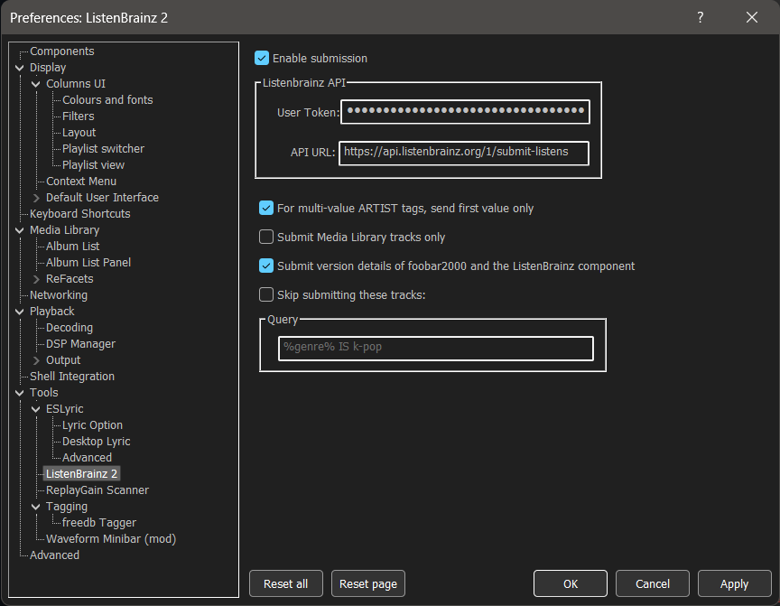

# ListenBrainz 2

A foobar2000 component to submit the music you listened to to [ListenBrainz](https://listenbrainz.org).

This component was originally written by [marc2k3](https://github.com/marc2k3/).
This repository is an attempt to preserve the source code of this excellent
component and hopefully to revive the development.

## Minimum requirements

`Windows 7` and [foobar2000](https://foobar2000.org) `v1.5` or later. This component is compatible with foobar2000 `v2.0`, both 32 and 64 bit.

## Download
[https://github.com/phw/foo_listenbrainz2/releases](https://github.com/phw/foo_listenbrainz2/releases)

## Installation

[https://wiki.hydrogenaud.io/index.php?title=Foobar2000:How_to_install_a_component](https://wiki.hydrogenaud.io/index.php?title=Foobar2000:How_to_install_a_component)

## What is ListenBrainz?

ListenBrainz keeps track of music you listen to and provides you with insights into your listening habits. For details see:

[https://listenbrainz.org](https://listenbrainz.org)

## Why foo_listenbrainz2?

There is already a component with the original name here: [foo_listenbrainz](https://gitlab.com/ykBuilds/foo_listenbrainz)

In contrast to the above version foo_listenbrainz2 does not block the main thread and does not freeze the UI when submitting. Also, this version submits artist/recording [MBID](https://musicbrainz.org/doc/MusicBrainz_Identifier)s if present in your files. This makes artist/title links on your recent listens page clickable and will lead you to the respective pages on [musicbrainz.org](https://musicbrainz.org)

## Preferences

Enter your [ListenBrainz token](https://listenbrainz.org/profile) and check the other options under
`File > Preferences > Tools > ListenBrainz 2`.

Now just listen to your music and watch the `Console` for server responses and/or check your recent listens page.

For convenience, submissions can be enabled/disabled via the main `Playback` menu. This option is only available after your token has been set. You can also configure a filter for tracks to never be submitted.

## Submissions

The following conditions must be met for a track to be submitted:

- The track must be at least 5 seconds long. Anything shorter or unknown will be ignored.
- Like [Last.fm](https://last.fm), you must listen to at least half the track or 4 minutes - whichever comes first.
- The submission must be enabled when the track begins AND at the time of submission during playback.
- The track must contain `ARTIST` and `TITLE` tags as a bare minimum. Any tracks without them are silently ignored.

These additional tags are sent if present:

- `ALBUM ARTIST`
- `ALBUM`
- `DATE`
- `TRACKNUMBER`
- `TOTALTRACKS`
- `DISCNUMBER`
- `TOTALDISCS`
- `ISRC`
- `MUSICBRAINZ_ARTISTID / MUSICBRAINZ ARTIST ID`
- `MUSICBRAINZ_TRACKID / MUSICBRAINZ TRACK ID`
- `MUSICBRAINZ_ALBUMID / MUSICBRAINZ ALBUM ID`
- `MUSICBRAINZ_RELEASEGROUPID / MUSICBRAINZ RELEASE GROUP ID`
- `MUSICBRAINZ_RELEASETRACKID / MUSICBRAINZ RELEASE TRACK ID`
- `MUSICBRAINZ_WORKID / MUSICBRAINZ WORK ID`
- The track's duration in seconds

Note that [foobar2000](https://foobar2000.org) does not support reading track id ([recording](https://musicbrainz.org/doc/Recording)) tags that are written to MP3s as `UFID` by [MusicBrainz Picard](https://picard.musicbrainz.org/).

By default details about the media player ("foobar2000" and version) and the submission client ("foo_listenbrainz2" and component version) will be submitted as well. If you dislike this behavior you can disable it in the preferences.

## Multi-value tag handling

- For artist/work [MBID](https://musicbrainz.org/doc/MusicBrainz_Identifier)s, all values are sent.
- By default, only the first value of any multi-value `ARTIST` tag is sent. This can be changed in the preferences so all values are sent as a comma separated string. Before this option was added in `v1.1.3`, only the first value was sent.
- For all other tags, only the first value is sent.

## Caching of failed submissions

This happens automatically so you don't need to do anything to trigger it. If you're offline or [ListenBrainz](https://listenbrainz.org) is down, the `Console` will report each time a `listen` is cached and the next time you submit a successful `listen`, an attempt will be made to submit all cached entries.

## Limitations

- Currently there is no support for streams or tracks of an unknown length.
- [foobar2000](https://foobar2000.org) does not support reading track id ([recording](https://musicbrainz.org/doc/Recording)) tags that are written to MP3s as `UFID` by [MusicBrainz Picard](https://picard.musicbrainz.org/).

## License

foo_listenbrainz2 is published under the MIT license. See [LICENSE.txt](./LICENSE.txt) for details.
